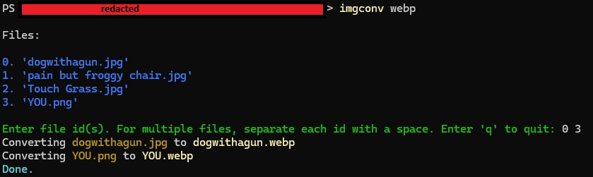
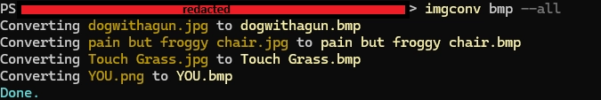

# Ez Terminal Image Converter
Tired of using an online image converter that limits how many images you can do per day? Me too! So I created a simple Python script to do it for free!

This script uses the terminal (sorry no GUI) to convert files in a folder to whatever extension you want (or whatever Python Pillow supports)!

## Set Up (for Windows)
This is how I set it up on my device:
1. [Download the program](https://github.com/MDHamel/ez-terminal-image-converter/releases) zip and unzip it somewhere onto your PC.
   1. Note the file path for the `EzTerminalImageConverter/image-conversion.py` (right-click, 'Copy as Path') 
   2. pip install the requirements:
   `pip install pillow`
2. Next, open PowerShell or CMD and enter `$profile`.
   1. This should return a path to your terminal profiles.
3. The terminal should have printed a file path for you, open that file with your text editor (Notepad works fine).

4. Make a new function that looks something like this:
   1. `imgconv` will be the command in the terminal, you can change this to whatever name suits your needs.
```
function imgconv{
    python "path/from/step1" $args
}
```
1. Save your profiles, restart your terminal, and DONE!

## How To Use
Open your desired directory in your terminal and then call the name of the function. The only required argument is the file extension you want to convert to (png, jpg, ico, webp).

After that, it will have you select your image file(s), and then the script converts the selected files.

If you want to convert all the image files in the directory, add `--all` or `--a` to your arguments

You can also change the quality from 1 to 100 (100 by default) by adding 
`--quality <number between 1 and 100>` or `--q <number between 1 and 100>`

## Examples

